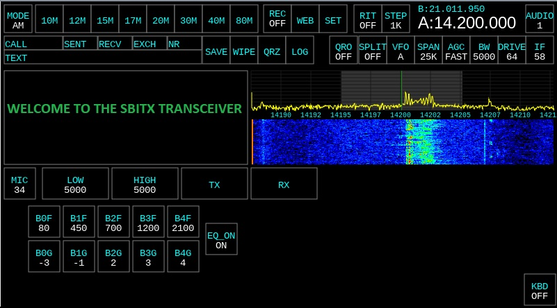

An improved version of the sBitx application designed for the sBitx hardware. This version is only for the 64 bit Raspberry Pi image that can be downloaded here. We do not support legacy, insecure, buggy, 32 bit platforms anymore.

We now have a devepment team collaborating on improvements for the sBitx platform. JJ - W9JES, Jon - W2JON, Alan - N1QM and Jeff - KF7YDU. Thank you to all who provide countless hours to this project!

The files here are to designed to work on the modified, 64 bit version provided here in the *Releases* section.

The stand-alone version of sBitx toolbox for 64 bit is available [HERE](https://github.com/drexjj/sBITX-toolbox64)

The stand-alone version of sBitx toolbox for 32 bit (original version from HF Signals) is available [HERE](https://github.com/drexjj/sBITX-toolbox)


****Backup Your Data First!****
-----
It is important to backup your existing sbitx/data and sbitx/web folders to a safe place before installing this version. A good data backup strategy is important so you do not lose your logbook, hardware calibration, and user settings.

There are two methods that you can use to perform a backup. I wrote a handy, backup utility for the original and modified versions of sBitx software. It can be installed from sBitx Toolbox and is called sBITX EZ Data. This will copy your critical, data files to a USB drive. Check it out from the links above. Or you can continue below and copy the contents to a USB drive manually.

You can make a copy of your original sbitx folder in entirety by using this set of commands from terminal
```console
cd $HOME && mv sbitx sbitx_orig
```
You can restore the sbitx/data and sbitx/web folders from your backup to the newly installed sbitx folder using these commands from terminal
```console
cd $HOME && cp -r sbitx_orig/web/* sbitx/web/ && cp -r sbitx_orig/data/* sbitx/data/
```

First Time Installation and Upgrades
-----

Visit the new Wiki page for more information [HERE](https://github.com/drexjj/sbitx/wiki/How-to-install-or-upgrade-your-sBitx-application)  


****Download The 64 Bit Image****
-----
A preconfigured, downloadable Raspberry Pi 4 image file is available as a beta release. This Pi image is designed to fit a 32GB SD card or USB drive and installed with Balena Etcher.

As a bonus, sBITX Toolbox is preinstalled on the image as well as other useful tools for ham radio use.

A new, production version is available [HERE](https://github.com/drexjj/sbitx/releases)


Become A Supporter
-----
If you find these enhancements valuable or have benefited from using it, consider supporting us. Every donation, big or small, helps us keep the lights on and the code flowing.

🌟 [Donate](https://www.paypal.com/donate/?hosted_button_id=SWPB76LVNUHEY) 🌟


Not in a position to donate? No worries! Contributing code, documentation, or simply spreading the word about this effort also goes a long way.

Thank you for your support and belief in my project!

